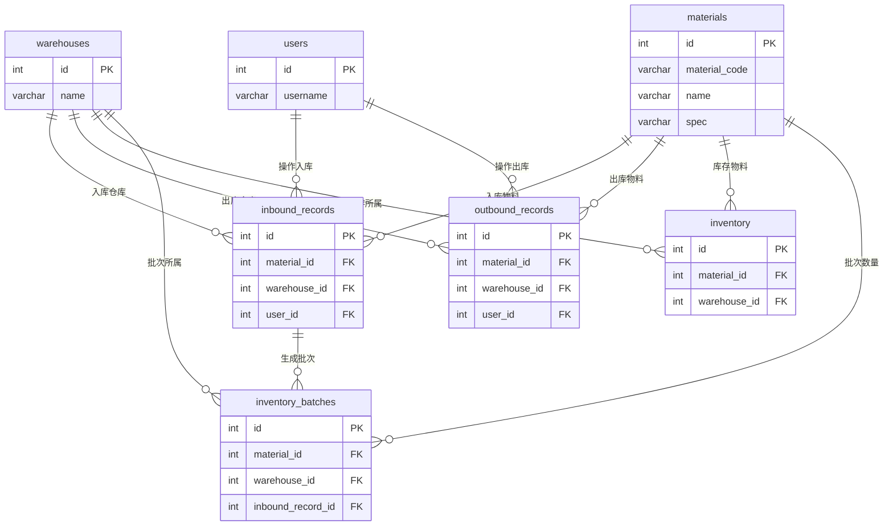

# 数据库文档 - winwms

本文档详细描述了 `winwms` 仓储管理系统的数据库结构。该数据库旨在管理仓库、物料、库存以及出入库操作。

## 数据库: `winwms`

- **默认字符集**: `utf8mb4`
- **排序规则**: `utf8mb4_unicode_ci`

---

## ER 图与整体结构说明

### 概念 ER 图（文字描述）

- 一个 `users`（用户）可以执行多次入库和出库操作：
  - `users (1) —— (N) inbound_records`
  - `users (1) —— (N) outbound_records`
- 一个 `warehouses`（仓库）可以包含多种物料的库存和批次：
  - `warehouses (1) —— (N) inbound_records`
  - `warehouses (1) —— (N) outbound_records`
  - `warehouses (1) —— (N) inventory`
  - `warehouses (1) —— (N) inventory_batches`
- 一个 `materials`（物料）可以在多个仓库中有库存与批次：
  - `materials (1) —— (N) inbound_records`
  - `materials (1) —— (N) outbound_records`
  - `materials (1) —— (N) inventory`
  - `materials (1) —— (N) inventory_batches`
- 一个 `inbound_records`（入库记录）可以生成一个或多个 `inventory_batches`（库存批次）：
  - `inbound_records (1) —— (N) inventory_batches`

### 逻辑关系图（Mermaid 文本，可复制到支持 Mermaid 的工具中渲染）

> 说明：上方 Mermaid 代码可直接粘贴到 VS Code + Mermaid 插件、Typora、MkDocs、Obsidian 等支持 Mermaid 的工具中生成 ER 图。

---

## 表关系详情

### 外键关系一览

| 源表 | 源字段 | 目标表 | 目标字段 | 约束名 | 级联规则 |
| --- | --- | --- | --- | --- | --- |
| `inbound_records` | `material_id` | `materials` | `id` | `fk_inbound_material` | ON DELETE CASCADE |
| `inbound_records` | `warehouse_id` | `warehouses` | `id` | `fk_inbound_warehouse` | ON DELETE CASCADE |
| `inbound_records` | `user_id` | `users` | `id` | `fk_inbound_user` | ON DELETE RESTRICT |
| `outbound_records` | `material_id` | `materials` | `id` | `fk_outbound_material` | ON DELETE CASCADE |
| `outbound_records` | `warehouse_id` | `warehouses` | `id` | `fk_outbound_warehouse` | ON DELETE CASCADE |
| `outbound_records` | `user_id` | `users` | `id` | `fk_outbound_user` | ON DELETE RESTRICT |
| `inventory_batches` | `material_id` | `materials` | `id` | `fk_batch_material` | ON DELETE CASCADE |
| `inventory_batches` | `warehouse_id` | `warehouses` | `id` | `fk_batch_warehouse` | ON DELETE CASCADE |
| `inventory_batches` | `inbound_record_id` | `inbound_records` | `id` | `fk_batch_inbound_record` | ON DELETE CASCADE |
| `inventory` | `material_id` | `materials` | `id` | `fk_inventory_material` | ON DELETE CASCADE |
| `inventory` | `warehouse_id` | `warehouses` | `id` | `fk_inventory_warehouse` | ON DELETE CASCADE |

---

## 表结构

### 1. `users` (用户表)

**描述:** 存储系统用户信息，包括登录凭证和角色。

| 字段名 | 数据类型 | 约束 | 描述 |
| --- | --- | --- | --- |
| `id` | `INT` | NOT NULL, AUTO_INCREMENT, PRIMARY KEY | 用户ID，主键 |
| `username` | `VARCHAR(50)` | NOT NULL, UNIQUE | 用户名，必须唯一 |
| `password_hash` | `VARCHAR(255)` | NOT NULL | 加密后的密码哈希 (使用 BCrypt) |
| `role` | `VARCHAR(20)` | NOT NULL, DEFAULT 'Operator' | 用户角色 (例如: Admin, Operator) |
| `created_at` | `TIMESTAMP` | NOT NULL, DEFAULT CURRENT_TIMESTAMP | 用户创建时间 |

---

### 2. `warehouses` (仓库信息表)

**描述:** 存储仓库的基本信息。

| 字段名 | 数据类型 | 约束 | 描述 |
| --- | --- | --- | --- |
| `id` | `INT` | NOT NULL, AUTO_INCREMENT, PRIMARY KEY | 仓库ID，主键 |
| `name` | `VARCHAR(100)` | NOT NULL, UNIQUE | 仓库名称，必须唯一 |
| `location` | `VARCHAR(255)` | DEFAULT NULL | 仓库位置描述 |
| `created_at` | `TIMESTAMP` | NOT NULL, DEFAULT CURRENT_TIMESTAMP | 创建时间 |

---

### 3. `materials` (物料信息表)

**描述:** 存储所有物料的详细信息，包括编码、名称、规格和标准单价。

| 字段名 | 数据类型 | 约束 | 描述 |
| --- | --- | --- | --- |
| `id` | `INT` | NOT NULL, AUTO_INCREMENT, PRIMARY KEY | 物料ID，主键 |
| `material_code` | `VARCHAR(50)` | NOT NULL | 物料编码 |
| `name` | `VARCHAR(100)` | NOT NULL | 物料名称 |
| `spec` | `VARCHAR(100)` | NOT NULL | 物料规格 |
| `unit` | `VARCHAR(20)` | DEFAULT '个' | 计量单位 |
| `price` | `DECIMAL(10, 2)` | NOT NULL, DEFAULT 0.00 | 标准单价 (用于入库) |
| `created_at` | `TIMESTAMP` | NOT NULL, DEFAULT CURRENT_TIMESTAMP | 创建时间 |
| *Unique Key* | `(material_code, spec)` | | 物料编码和规格组合必须唯一 |

---

### 4. `inbound_records` (入库记录表)

**描述:** 记录每一次物料入库的操作历史。

| 字段名 | 数据类型 | 约束 | 描述 |
| --- | --- | --- | --- |
| `id` | `INT` | NOT NULL, AUTO_INCREMENT, PRIMARY KEY | 入库记录ID，主键 |
| `material_id` | `INT` | NOT NULL, FOREIGN KEY → `materials(id)` | 物料ID (外键) |
| `warehouse_id` | `INT` | NOT NULL, FOREIGN KEY → `warehouses(id)` | 仓库ID (外键) |
| `user_id` | `INT` | NOT NULL, FOREIGN KEY → `users(id)` | 操作员ID (外键) |
| `quantity` | `INT` | NOT NULL | 入库数量 |
| `price` | `DECIMAL(10, 2)` | NOT NULL | 入库时的单价 |
| `remark` | `TEXT` | DEFAULT NULL | 备注信息 |
| `inbound_date` | `TIMESTAMP` | NOT NULL, DEFAULT CURRENT_TIMESTAMP | 入库时间 |

**业务说明：**
- 一条记录代表一次完整的入库操作（时间点 + 物料 + 仓库 + 数量 + 单价 + 操作员）。
- 后续会基于此记录生成对应的 `inventory_batches` 记录。

---

### 5. `outbound_records` (出库记录表)

**描述:** 记录每一次物料出库的操作历史。

| 字段名 | 数据类型 | 约束 | 描述 |
| --- | --- | --- | --- |
| `id` | `INT` | NOT NULL, AUTO_INCREMENT, PRIMARY KEY | 出库记录ID，主键 |
| `material_id` | `INT` | NOT NULL, FOREIGN KEY → `materials(id)` | 物料ID (外键) |
| `warehouse_id` | `INT` | NOT NULL, FOREIGN KEY → `warehouses(id)` | 仓库ID (外键) |
| `user_id` | `INT` | NOT NULL, FOREIGN KEY → `users(id)` | 操作员ID (外键) |
| `quantity` | `INT` | NOT NULL | 出库数量 |
| `price` | `DECIMAL(10, 2)` | NOT NULL | 出库时的成本单价 (FIFO计算得出) |
| `remark` | `TEXT` | DEFAULT NULL | 备注信息 |
| `outbound_date` | `TIMESTAMP` | NOT NULL, DEFAULT CURRENT_TIMESTAMP | 出库时间 |

**业务说明：**
- 一条记录代表一次完整的出库操作（时间点 + 物料 + 仓库 + 数量 + 成本单价 + 操作员）。
- 出库成本 `price` 由系统根据 `inventory_batches` 做 FIFO 计算后写入。

---

### 6. `inventory_batches` (库存批次表)

**描述:** 存储每个物料的库存批次信息，用于实现先进先出(FIFO)成本计算。

| 字段名 | 数据类型 | 约束 | 描述 |
| --- | --- | --- | --- |
| `id` | `INT` | NOT NULL, AUTO_INCREMENT, PRIMARY KEY | 批次ID，主键 |
| `material_id` | `INT` | NOT NULL, FOREIGN KEY → `materials(id)` | 物料ID (外键) |
| `warehouse_id` | `INT` | NOT NULL, FOREIGN KEY → `warehouses(id)` | 仓库ID (外键) |
| `inbound_record_id` | `INT` | NOT NULL, FOREIGN KEY → `inbound_records(id)` | 关联的入库记录ID (外键) |
| `batch_no` | `VARCHAR(50)` | NOT NULL, UNIQUE | 批次号 |
| `quantity` | `INT` | NOT NULL | 当前批次剩余数量 |
| `unit_price` | `DECIMAL(10, 2)` | NOT NULL | 该批次的单位成本 |
| `total_amount` | `DECIMAL(12, 2)` | NOT NULL | 该批次的总金额 |
| `inbound_date` | `TIMESTAMP` | NOT NULL | 批次入库时间 |
| `remark` | `TEXT` | DEFAULT NULL | 备注 |

**业务说明：**
- 每条入库记录通常会对应 1 条或多条批次记录（根据实际业务拆分逻辑）。
- 出库时按 `inbound_date` 或 `id` 递增顺序依次扣减 `quantity`，实现 FIFO。

---

### 7. `inventory` (库存汇总表)

**描述:** 实时汇总每个物料在不同仓库的库存总量和加权平均成本。

| 字段名 | 数据类型 | 约束 | 描述 |
| --- | --- | --- | --- |
| `id` | `INT` | NOT NULL, AUTO_INCREMENT, PRIMARY KEY | 库存ID，主键 |
| `material_id` | `INT` | NOT NULL, FOREIGN KEY → `materials(id)` | 物料ID (外键) |
| `warehouse_id` | `INT` | NOT NULL, FOREIGN KEY → `warehouses(id)` | 仓库ID (外键) |
| `quantity` | `INT` | NOT NULL | 当前总库存数量 |
| `unit_price` | `DECIMAL(10, 2)` | NOT NULL | 加权平均单价 |
| `total_amount` | `DECIMAL(12, 2)` | NOT NULL | 库存总金额 |
| `last_updated` | `TIMESTAMP` | NOT NULL, DEFAULT CURRENT_TIMESTAMP ON UPDATE CURRENT_TIMESTAMP | 最后更新时间 |
| *Unique Key* | `(material_id, warehouse_id)` | | 物料和仓库的组合必须唯一 |

**业务说明：**
- 作为汇总表，保存的是当前时点的库存数量与金额信息。
- 一般在每次入库、出库时，由应用程序通过事务同步更新。
