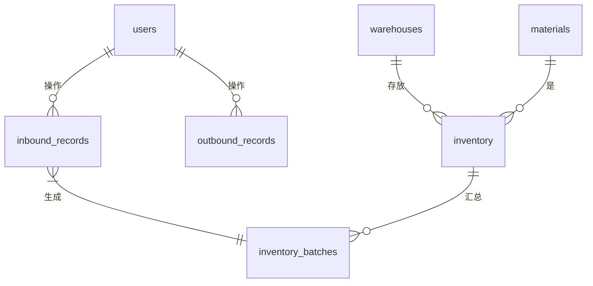

# WinWMS 仓储管理系统 - 项目文档

## 1. 项目概述

### 1.1 项目背景

WinWMS 是一个为中小型企业设计的桌面仓储管理系统（Warehouse Management System）。该系统旨在通过数字化手段，替代传统的手工记账和Excel表格管理方式，从而提高仓库管理的准确性、效率和透明度。系统核心功能包括物料信息管理、库存实时追踪、出入库流程控制以及基本的报表查询，帮助企业实现精细化的库存控制。

### 1.2 项目目标

*   **标准化管理流程：** 建立规范的物料、仓库、用户等基础数据管理体系。
*   **精确库存控制：** 实现对物料库存数量、位置和成本的实时、准确跟踪。
*   **流程自动化：** 自动化处理入库、出库操作，自动生成批次信息，并采用加权平均法和先进先出（FIFO）原则进行成本核算。
*   **数据可追溯：** 记录每一次出入库操作的详细信息，确保所有库存变动都有据可查。
*   **提升决策效率：** 提供库存查询、月度报表等功能，为采购和销售决策提供数据支持。

### 1.3 技术栈

*   **前端：** C# WinForms (.NET 8)
*   **后端逻辑：** C# (.NET 8)
*   **数据库：** MySQL
*   **数据访问：** `MySql.Data` 库

## 2. 需求分析

### 2.1 功能需求

| 模块 | 功能点 | 详细描述 |
| :--- | :--- | :--- |
| **用户管理** | 用户登录与角色 | 系统支持不同角色的用户（如管理员、操作员），未来可扩展权限控制。 |
| | 用户信息维护 | 管理员可以增、删、改、查用户信息。 |
| **基础数据管理** | 物料管理 | - 维护物料信息，包括物料编码、名称、规格、单位和标准单价。 - 物料编码和规格的组合必须唯一，确保物料的唯一性。 |
| | 仓库管理 | - 维护仓库的基本信息，如仓库名称和位置。 - 仓库名称必须唯一。 |
| **入库管理** | 添加入库记录 | - 操作员选择物料、规格、仓库，并输入数量。 - 系统自动获取物料的标准单价，记录入库操作。 |
| | 生成库存批次 | - 每次入库操作成功后，系统自动生成一个唯一的库存批次号。 - 创建一条 `inventory_batches` 记录，用于支持先进先出（FIFO）成本核算。 |
| | 更新库存 | - 实时更新 `inventory` 库存汇总表，增加库存数量，并采用**加权平均法**重新计算库存成本。 |
| **出库管理** | 添加出库记录 | - 操作员选择物料、规格、仓库，并输入出库数量。 - 系统检查库存是否充足。 |
| | FIFO成本核算 | - 根据 `inventory_batches` 表中批次的入库时间，遵循**先进先出（FIFO）**原则，依次扣减批次数量并计算出库成本。 |
| | 更新库存 | - 实时更新 `inventory` 库存汇总表，减少库存数量，并重新计算加权平均成本。 |
| **库存管理** | 库存查询 | - 用户可以按物料、仓库等条件查询当前实时库存数量、总金额和加权平均单价。 |
| | 记录查询 | - 提供按条件查询入库记录和出库记录的功能。 |
| **报表与分析** | 月度报表 | - 生成指定月份的出入库汇总报表，分析物料流动情况。 |

### 2.2 非功能需求

*   **易用性：** 界面设计直观简洁，操作流程符合仓管人员的日常工作习惯。
*   **可靠性：** 关键数据库操作（如出入库）必须使用事务处理，确保数据的一致性和完整性。
*   **性能：** 对常用查询（如库存查询）进行优化，保证系统响应的及时性。
*   **可维护性：** 代码结构清晰，分为表现层、业务逻辑层和数据访问层，便于后续功能扩展和维护。

## 3. 总体设计

### 3.1 系统架构

本系统采用经典的三层架构模型：

1.  **表现层 (Presentation Layer):**
    *   **技术：** WinForms。
    *   **职责：** 提供用户交互界面，如 `InboundForm`、`OutboundForm` 等。负责接收用户输入、展示数据和调用业务逻辑层处理请求。

2.  **业务逻辑层 (Business Logic Layer):**
    *   **技术：** C# 类和方法。
    *   **职责：** 实现系统的核心业务规则。例如，在 `InboundForm.cs` 的 `BtnInbound_Click` 事件处理器中，包含了入库操作的完整逻辑：数据验证、记录生成、批次创建和库存更新。

3.  **数据访问层 (Data Access Layer):**
    *   **技术：** `DbHelper` 静态类，使用 `MySql.Data` 驱动。
    *   **职责：** 封装对数据库的所有操作（增、删、改、查），向上层提供统一的数据服务接口，隐藏数据库实现的细节。

### 3.2 数据库设计

数据库 `winwms` 是整个系统的核心，其设计遵循关系型数据库范式，确保了数据的结构化和一致性。

*   **ER 图 (概念):**
    

*   **核心表说明：**
    *   `users`, `warehouses`, `materials`: 存储基础信息的主数据表。
    *   `inbound_records`, `outbound_records`: 记录每一次库存流动的事务历史表。
    *   `inventory_batches`: 库存批次表，是实现 FIFO 的关键。它将每一次入库的物料作为独立的批次进行管理。
    *   `inventory`: 库存汇总表，作为物料在特定仓库的实时快照，存储总数量和加权平均成本，用于快速查询和展示。

## 4. 详细设计

### 4.1 核心模块实现

#### 4.1.1 数据访问模块 (`DbHelper.cs`)

该模块是一个静态帮助类，封装了所有与 MySQL 数据库的交互。

*   `GetConnectionString()`: 集中管理数据库连接字符串。
*   `ExecuteQuery(string query, params MySqlParameter[] parameters)`: 执行查询操作（SELECT），并返回一个 `DataTable`。
*   `ExecuteNonQuery(string query, params MySqlParameter[] parameters)`: 执行非查询操作（INSERT, UPDATE, DELETE），并返回受影响的行数。
*   `ExecuteTransaction(List<MySqlCommand> commands)`: 执行数据库事务，用于处理需要原子性操作的业务，如完整的出入库流程。

#### 4.1.2 入库流程 (`InboundForm.cs`)

这是系统中最典型的业务流程之一，涉及多表操作。

1.  **界面加载与数据绑定：**
    *   `InboundForm()` 构造函数初始化界面组件，并调用 `LoadMaterialNames()` 和 `LoadWarehouses()` 从数据库加载物料名称和仓库列表到下拉框。
    *   `CmbMaterial_SelectedIndexChanged` 事件实现级联选择：当用户选择物料名称后，触发 `LoadMaterialSpecs()`，加载该物料的所有规格。

2.  **执行入库 (`BtnInbound_Click`)：**
    *   **数据验证：** 检查物料、规格、仓库是否已选择，以及数量是否大于 0。
    *   **获取物料信息：** 从 `cmbSpec` 的 `SelectedValue` 获取 `material_id`，并查询 `materials` 表以获取其标准单价 `price`。
    *   **事务开始（逻辑上）：**
        1.  **插入入库记录：** 向 `inbound_records` 表插入一条新记录，包含物料ID、仓库ID、数量、单价等信息。
        2.  **获取新记录ID：** 使用 `SELECT LAST_INSERT_ID()` 获取刚生成的入库记录ID。
        3.  **生成批次号：** 调用 `GenerateBatchNo()` 方法，根据 "PC + 物料ID + 仓库ID + 日期 + 当日序号" 的规则生成唯一批次号。
        4.  **插入库存批次：** 向 `inventory_batches` 表插入一条批次记录，关联到入库记录ID。
        5.  **更新库存汇总：**
            *   查询 `inventory` 表是否存在该物料在该仓库的记录。
            *   **如果存在：** 更新（UPDATE）该记录。新的总数量 = `原数量 + 入库数量`，新的总金额 = `原总金额 + (入库数量 * 入库单价)`，并重新计算加权平均单价。
            *   **如果不存在：** 插入（INSERT）一条新的库存记录。
    *   **事务结束。**
    *   **用户反馈：** 弹出消息框，显示入库成功信息和批次号。
    *   **清空表单：** 调用 `ClearForm()` 方法，重置界面，方便下一次操作。

#### 4.1.3 出库流程 (设计思路)

出库是比入库更复杂的流程，因为它需要实现 FIFO 成本核算。

1.  **界面与验证：** 类似于入库，用户选择物料、仓库并输入数量。系统首先检查 `inventory` 表确保库存充足。
2.  **执行出库（事务中）：**
    *   **获取批次列表：** 查询 `inventory_batches` 表，获取该物料在该仓库的所有未用尽的批次，并按 `inbound_date` 或 `id` 升序排序。
    *   **循环扣减批次：**
        *   遍历批次列表，从最早的批次开始扣减出库数量。
        *   如果当前批次数量足够，则扣减并记录该批次的成本，然后跳出循环。
        *   如果当前批次数量不足，则完全消耗此批次，记录其成本和数量，然后用剩余的出库数量继续扣减下一个批次。
    *   **计算总出库成本：** 将所有被消耗批次的成本累加，得到本次出库的总成本和加权出库单价。
    *   **插入出库记录：** 向 `outbound_records` 表插入一条记录，其中 `price` 字段存储计算出的加权出库单价。
    *   **更新库存汇总：** 在 `inventory` 表中减去相应的数量和成本，并重新计算加权平均单价。

## 5. 测试

为确保系统质量，需要设计以下测试环节：

### 5.1 单元测试

*   **测试对象：** `DbHelper` 类的方法、`GenerateBatchNo()` 等独立功能函数。
*   **示例：**
    *   测试 `GenerateBatchNo()` 在一天内对同一物料多次入库时，能否正确生成递增的序号。
    *   测试 `DbHelper.ExecuteQuery` 在传入非法SQL时是否能正确处理异常。

### 5.2 集成测试

*   **测试对象：** 涉及多个模块协作的完整业务流程。
*   **示例：**
    *   **入库流程测试：** 执行一次完整的入库操作，然后验证 `inbound_records`、`inventory_batches` 和 `inventory` 三个表的数据是否都按预期更新。
    *   **出库流程测试 (FIFO)：**
        1.  入库A批次：10个，单价10元。
        2.  入库B批次：20个，单价12元。
        3.  出库15个。验证系统是否先扣减A批次的10个，再扣减B批次的5个，并正确计算出库成本。
        4.  验证 `inventory_batches` 表中A批次剩余为0，B批次剩余为15。

### 5.3 系统测试/用户验收测试 (UAT)

*   **测试对象：** 整个应用程序。
*   **方法：** 模拟仓库管理员的日常工作场景，执行端到端的操作。
*   **示例：**
    *   场景1：新物料首次入库。
    *   场景2：对已有库存的物料进行多次、不同单价的入库。
    *   场景3：库存部分出库和全部出库。
    *   场景4：出库数量大于库存时的错误处理。
    *   场景5：查询特定物料在所有仓库的库存分布。

## 6. 小结

WinWMS 项目成功地为中小型企业提供了一个功能完整、操作简便的仓储管理解决方案。通过采用.NET技术和MySQL数据库，系统实现了对物料、库存、出入库流程的有效管理。特别是其对库存批次和成本核算（加权平均与FIFO）的精细化处理，为企业进行成本控制和经营决策提供了可靠的数据基础。

未来，系统可在以下方面进行扩展：
*   **权限细化：** 引入更复杂的角色和权限管理体系。
*   **Web化/云化：** 将应用迁移至Web平台，支持多用户远程访问。
*   **高级报表：** 引入图表库，提供可视化的数据分析报表，如库存周转率、库龄分析等。
*   **条码/RFID集成：** 支持通过扫描设备快速进行出入库操作，进一步提升效率。

## 参考文献

*   `DatabaseDocumentation.md`: 项目数据库结构详细设计文档。
