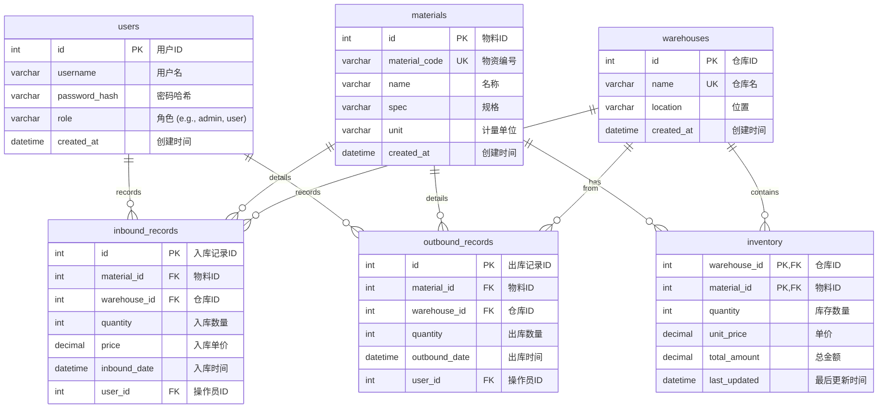

# 仓储管理系统 E-R 图

这是一个基于 Mermaid.js 格式的实体关系图，描述了仓储管理系统的核心数据结构。

### 表关系说明：

*   一个 `users` (用户) 可以有多条 `inbound_records` (入库记录) 和 `outbound_records` (出库记录)。
*   一个 `materials` (物料) 可以存在于多个 `inventory` (库存) 条目中（每个仓库一个），并且可以有多条入库和出库记录。
*   一个 `warehouses` (仓库) 可以包含多种物料的 `inventory` (库存)，并且是入库和出库操作的目标或来源。
*   `inventory` (库存) 表是 `materials` 和 `warehouses` 的关联表，通过 `material_id` 和 `warehouse_id` 联合主键来唯一确定一种物料在特定仓库的库存情况。
